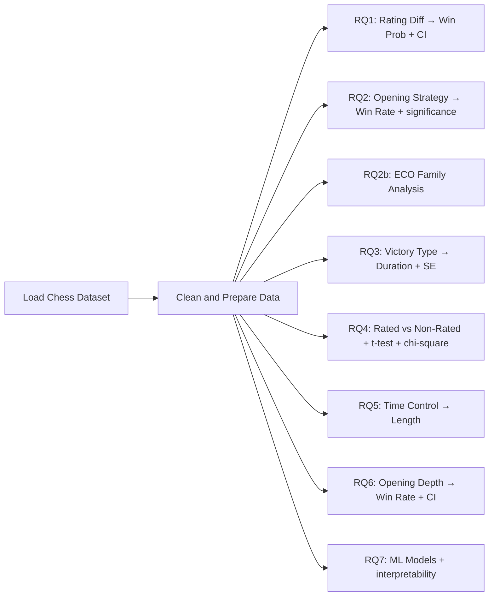

# Chess Dataset ML Project

A data science and machine learning exploration of a large chess game dataset (~20,000 games) with statistical rigor and model interpretability.

## Project Summary

Analyzes chess game outcomes, opening strategies, time controls, and model performance.

Key goals:

- Measure how rating difference influences win probability
- Identify openings with the highest White win rate (with significance testing)
- Compare game duration across victory types
- Analyze the effect of rated vs non-rated play (with hypothesis tests)
- Explore time control effects on game length
- Evaluate opening depth impact on White performance
- Train, tune, and interpret classification models on game outcomes

## Project Structure

```
├── Dataset/
│   └── games.csv                   # Raw dataset (~20K rows, 16 columns)
├── src/chess_ml/                   # Modular Python package
│   ├── __init__.py                 # Public API
│   ├── config.py                   # Paths, constants, thresholds
│   ├── data.py                     # Load, parse, and preprocessing
│   ├── analysis.py                 # RQ1–RQ6 + ECO analysis functions
│   ├── modeling.py                 # ML pipeline (RQ7) + tuning
│   └── plotting.py                 # All visualization functions
├── chess_analysis.py               # End-to-end runner script
├── notebooks/
│   └── chess_analysis.ipynb        # Interactive Jupyter notebook
├── outputs/
│   ├── tables/                     # Generated CSV tables
│   └── figures/                    # Generated PDF figures
├── requirements.txt
├── .gitignore
└── README.md
```

## Setup

### Option 1: Run locally

```bash
pip install -r requirements.txt
python chess_analysis.py
```

The script automatically detects the dataset at the Kaggle path or falls back to `Dataset/games.csv`.

### Option 2: Run in Jupyter

```bash
pip install -r requirements.txt
jupyter notebook notebooks/chess_analysis.ipynb
```

### Option 3: Run on Kaggle

Upload to Kaggle and open `chess_analysis.ipynb`. The default dataset path is pre-configured.

## Analysis Workflow



## Analytical Questions

### RQ1: Rating Difference → Win Probability

Bins games by `(white_rating - black_rating)`. Reports 95% Clopper-Pearson confidence intervals per bin. Bins: `<-200`, `-200 to 0`, `0 to 200`, `>200`.

### RQ2: Opening Strategy → White Win Rate

Groups by `opening_name`, filters openings with >=30 games, ranks top 10. Each opening is tested against the overall mean with a binomial test; significant results (p < 0.05) are highlighted.

### RQ2b: ECO Opening Family Analysis

Groups by ECO code family (A = Flank, B = Semi-Open, C = Open, D = Closed, E = Indian) and compares White win rates across families.

### RQ3: Victory Type → Game Duration

Computes mean turns per `victory_status` with standard error bars.

### RQ4: Rated vs Non-Rated

Welch's t-test and Mann-Whitney U test compare turn counts. Chi-square test compares win distributions between rated and unrated games.

### RQ5: Time Control → Game Length

Groups by `increment_code`, filters time controls with >=30 games, ranks top 10 by average turns.

### RQ6: Opening Depth → White Win Rate

Groups by `opening_ply`, filters depths with >=30 games, plots White win rate with 95% CI band.

### RQ7: Model Comparison & Interpretability

Trains three classifiers on `[white_rating, black_rating, rating_diff, opening_ply]` to predict `winner` (white/black/draw):

| Model | Metrics |
|---|---|
| Logistic Regression (scaled) | 5-fold CV, test accuracy, per-class F1 |
| Random Forest (200 trees) | 5-fold CV, test accuracy, feature importance |
| Gradient Boosting (200 trees) | 5-fold CV, test accuracy, feature importance |

All models use `StandardScaler` via `Pipeline`, stratified 80/20 split. Outputs include confusion matrices, classification reports, and feature importance plots.

## Key Improvements Over Original Notebook

- **Statistical rigor** — confidence intervals, binomial tests, t-tests, Mann-Whitney U, chi-square
- **Sample thresholds** — >=30 games per group to avoid small-sample bias
- **Extended rating bins** — `(-inf, inf)` edges cover all games
- **Model interpretability** — confusion matrices, classification reports, feature importance
- **ECO family analysis** — broader opening grouping beyond individual names
- **Time control parsing** — `increment_code` split into `base_time` and `increment` numeric columns
- **Modular package** — reusable functions, clean separation of concerns
- **Local/Kaggle compatibility** — auto-detects dataset path
- **Jupyter notebook** — interactive version with markdown explanations
- **Pinned dependencies** — `requirements.txt` with minimum versions
- **Clean repo** — `.gitignore` excludes outputs, data, and artifacts
