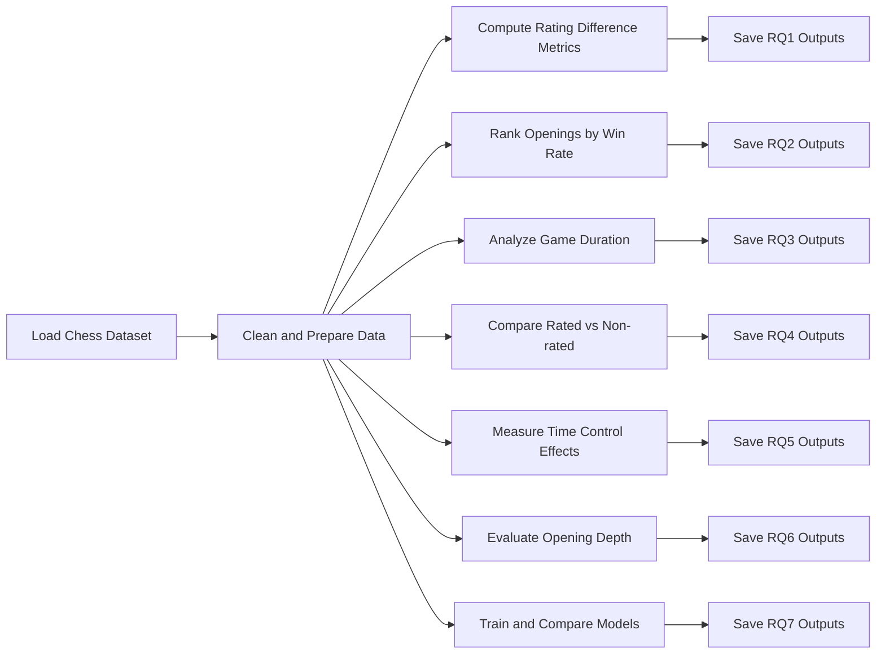

# Chess Dataset ML Project

A data science and machine learning exploration of a large chess game dataset, built from the notebook `Jordan Chess data sets.ipynb`.

## 🚀 Project Summary

This project analyzes chess game outcomes, opening strategies, time controls, and model performance using a Kaggle chess game dataset.

Key goals:
- Measure how rating difference influences win probability
- Identify openings with the highest White win rate
- Compare game duration across victory types
- Analyze the effect of rated vs non-rated play
- Explore time control effects on game length
- Evaluate opening depth impact on White performance
- Train and compare classification models on game outcomes

## 📂 Notebook and Data

- Notebook: `Jordan Chess data sets.ipynb`
- Raw dataset path used in notebook: `/kaggle/input/datasets/jordanjesudas/chess-game-dataset/games.csv`
- Generated output directories:
  - `outputs/tables/`
  - `outputs/figures/`

## 📊 Analysis Workflow



> The diagram above captures the full analysis path from data import to final results.

## 📌 Output Files

The notebook produces the following CSV tables and figure exports:

- `outputs/tables/RQ1_table.csv`
- `outputs/tables/RQ2_openings.csv`
- `outputs/tables/RQ3_duration.csv`
- `outputs/tables/RQ4_rated.csv`
- `outputs/tables/RQ4_win_distribution.csv`
- `outputs/tables/RQ5_time_control.csv`
- `outputs/tables/RQ6_opening_ply.csv`
- `outputs/tables/RQ7_model.csv`

- `outputs/figures/RQ1_figure.pdf`
- `outputs/figures/RQ2_figure.pdf`
- `outputs/figures/RQ3_figure.pdf`
- `outputs/figures/RQ4_figure.pdf`
- `outputs/figures/RQ4_win_dist.pdf`
- `outputs/figures/RQ5_duration.pdf`
- `outputs/figures/RQ6_figure.pdf`
- `outputs/figures/RQ7_figure.pdf`

## 🧠 Analytical Questions Covered

1. **RQ1:** How does rating difference affect White win probability?
2. **RQ2:** Which opening strategies yield the best White win rates?
3. **RQ3:** How long do games last, on average, by victory type?
4. **RQ4:** How do rated and non-rated games differ in length and win distribution?
5. **RQ5:** Which time controls correspond to longer games?
6. **RQ6:** How does opening ply depth impact White win rate?
7. **RQ7:** Which model performs better: Random Forest or Logistic Regression?

## 🔧 Reproduce Locally

### 1. Install dependencies

```bash
pip install pandas numpy matplotlib scikit-learn
```

### 2. Open the notebook

Open `Jordan Chess data sets.ipynb` in Jupyter or VS Code and run all cells.

### 3. Adjust the dataset path if needed

If you do not have the Kaggle dataset mounted at `/kaggle/input/...`, update the notebook path in the first data-loading cell to the local CSV file location.

### 4. Run the notebook

Execute every cell to regenerate the outputs in `outputs/tables/` and `outputs/figures/`.

## ✅ Model Comparison

The notebook trains two classification models on the features:
- `white_rating`
- `black_rating`
- `opening_ply`

Models compared:
- `RandomForestClassifier`
- `LogisticRegression`

The comparison is stored in `outputs/tables/RQ7_model.csv` and visualized in `outputs/figures/RQ7_figure.pdf`.
